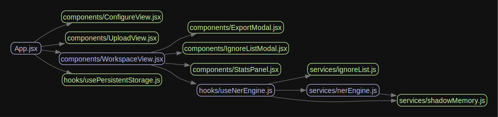

# 🛡️ Ba7ath OSINT Tracker — Manual Tagger

<p align="center">
  <strong>Outil universel d'extraction manuelle d'entités nommées (NER) pour les enquêtes en sources ouvertes.</strong><br/>
  Toutes les données restent privées et ne quittent jamais votre navigateur.
</p>

---
<p align="center">
  
</p>
## 🏗️ Architecture et Flux de Données (Ba7ath Tracker v1.7.0)

L'application suit une architecture modulaire stricte, séparant l'interface utilisateur (UI), la gestion d'état (Hooks), et la logique métier d'investigation (Services).

**1. Le Chef d'Orchestre (Point d'entrée)**
* `App.jsx` : Supervise le routage et distribue les vues principales de l'application (`ConfigureView`, `UploadView`, `WorkspaceView`) ainsi que la persistance globale (`usePersistentStorage`).

**2. Le Cœur de l'Interface (Le Hub)**
* `WorkspaceView.jsx` : C'est le centre de commandement de l'investigateur. Il délègue l'affichage détaillé à ses sous-composants dédiés (`ExportModal`, `IgnoreListModal`, `StatsPanel`) pour garder un code lisible et maintenable.

**3. Le Moteur Logique (Le Pont)**
* `useNerEngine.js` : C'est le Hook stratégique. Il fait le pont entre l'interface visuelle (`WorkspaceView`) et la machinerie lourde de l'IA. C'est ici que l'état de l'analyse est conservé.

**4. La Couche d'Intelligence et de Souveraineté (Services)**
L'extraction de données repose sur trois piliers isolés :
* `nerEngine.js` : Le middleware qui orchestre le modèle d'Intelligence Artificielle local.
* `ignoreList.js` : Le service gérant la Liste Rouge (filtrage du bruit documentaire).
* `shadowMemory.js` : Le service de forçage heuristique (Human-in-the-loop), appelé à la fois par le hook (pour apprendre des actions de l'utilisateur) et par le moteur NER (pour intercepter et écraser les prédictions de l'IA lors des analyses).

## ✨ Fonctionnalités

### 📥 Importation Multi-formats
- **CSV** via PapaParse et **Excel (.xlsx)** via SheetJS — lecture 100% côté client.
- Auto-détection intelligente des colonnes (ID, Titre, Texte).

### ⚙️ Configuration Avancée
- **Catégories 100% personnalisables** : définissez vos propres types d'entités avec couleurs et icônes.
- **Support de multiples colonnes de texte** : affichage simultané de plusieurs paragraphes sources.
- **Métadonnées dynamiques** : affichage sélectif du contexte (ID, uuid, colonnes CSV).
- **Règles de détection visuelle** : surlignage automatique des majuscules, acronymes et structures juridiques (support latin + cyrillique).

### 🏷️ Extraction & OSINT
- **Moteur Regex Optmisé** : détection mémorisée des entités potentielles pour une fluidité maximale.
- **Saisie assistée** : suggestions en temps réel des entités déjà extraites pour éviter les doublons.
- **Nettoyage automatique** : suppression des caractères invisibles et ponctuations parasites lors de la sélection.
- **Audit de Qualité** : détection automatique des variantes (ex: "TOTAL" vs "Total") avec **fusion intelligente en un clic**.

### 💾 Persistance & Robustesse
- **Stockage IndexedDB** : utilisation de `localforage` pour gérer des sessions massives sans limite de taille.
- **Restauration auto** : reprise immédiate après fermeture de l'onglet ou crash navigateur.
- **Virtualisation intelligente** : découpage des longs textes en blocs gérables pour préserver les performances.

### 📊 Tableau de Bord
- Couverture de la tâche en temps réel (Donut Chart).
- Top 10 des cibles les plus fréquentes.
- Distribution par catégorie d'entité.

### 📤 Exportation & Collaboration
- **Multi-format** : CSV (plat/groupé), JSON NER (format d'entraînement), et Graphes de réseau (Gephi, Neo4J).
- **Session Portable** : export complet de l'état de travail pour partage immédiat avec un collègue.

### ⌨️ Raccourcis Clavier
| Touche | Action |
|--------|--------|
| `←` / `→` | Navigation entre sources |
| `Entrée` | Validation de l'entité |
| `1` - `9` | Changement de catégorie (utilisez **Alt + Chiffre** si le focus est dans le champ nom) |
| `?` | Aide interactive |

---

## 🛠️ Prérequis

- [Node.js](https://nodejs.org/) ≥ 16.0
- npm (inclus avec Node.js) ou yarn / pnpm

## 🚀 Installation et Lancement

```bash
# 1. Cloner le dépôt
git clone https://github.com/Ba7athproject/ba7ath_osint_tracker.git
cd ba7ath-tagger

# 2. Installer les dépendances
npm install

# 3. Démarrer le serveur de développement
npm run dev
```

Ouvrez votre navigateur à l'URL locale (par défaut : `http://localhost:5173/`).

## 📖 Utilisation

1. **Chargement** — Importez un fichier CSV/Excel, ou reprenez une session existante (.json).
2. **Configuration** — Mappez les colonnes (ID, textes multiples, métadonnées), personnalisez vos catégories, et activez les règles de surbrillance.
3. **Analyse** — Lisez les textes, sélectionnez les entités pertinentes à la souris. Utilisez les raccourcis clavier pour accélérer le workflow.
4. **Review** — Consultez le tableau de bord pour suivre la progression, repérer les doublons, et identifier les entités les plus fréquentes.
5. **Export** — Exportez vos résultats (CSV plat, groupé, JSON NER, ou réseau), ou sauvegardez votre session complète pour la partager.

## 🏗️ Architecture

```
ba7ath-tagger/
├── src/
│   ├── hooks/
│   │   └── usePersistentStorage.js  # Moteur IndexedDB (localforage)
│   ├── components/
│   │   ├── WorkspaceView.jsx   # Logique virtuelle & Regex OSINT
│   │   ├── StatsPanel.jsx      # Audit & Fusion de données
│   │   └── ...
│   └── index.css               # Design System v4 & Dark Mode
└── ...
```

## 🧰 Technologies

| Technologie | Usage |
|---|---|
| **React + Vite** | Frontend rapide et modulaire |
| **Tailwind CSS v4** | Classes utilitaires, mode sombre natif |
| **localforage** | Stockage IndexedDB asynchrone |
| **PapaParse** | Lecture CSV côté client |
| **SheetJS (xlsx)** | Lecture Excel côté client |
| **Lucide React** | Icônes vectorielles légères |
| **Tauri** | Packaging desktop (optionnel) |

## 🤝 Contribution

1. *Fork* du projet
2. Branche feature : `git checkout -b feature/NomFeature`
3. Commit : `git commit -m 'Ajout feature'`
4. Push : `git push origin feature/NomFeature`
5. *Pull Request*

## 📄 Licence

Ce projet est sous licence **MIT** — voir [LICENSE](./LICENSE).
